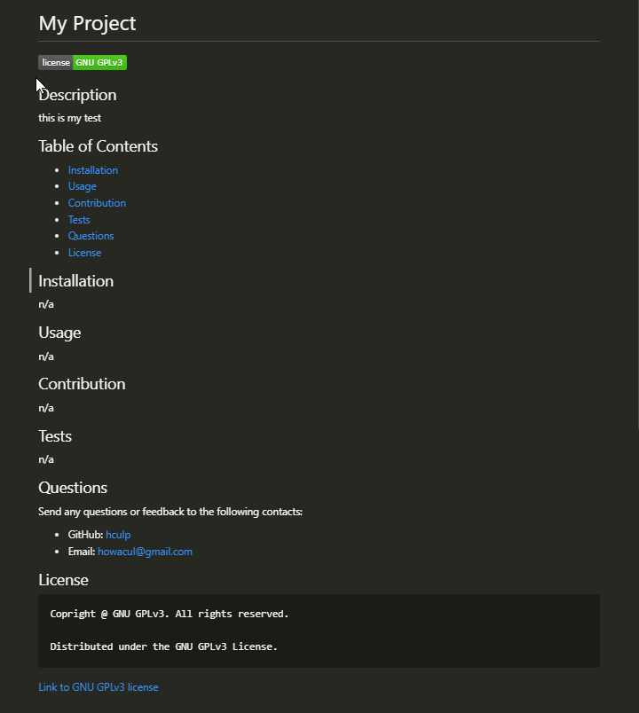

# Easy README Generator
  
  

  ## Description

  This is README.md file generator for use on coding projects. It is a command  line based utility that prompts the user for information about the title, description, table of contents, installation, usage, license, contributing, tests, and thier GitHub username and email for questions. User input is then used to generate each associated section of the README.md file. When a user selects a license from the list of options, then a badge is created by the top of the README.md with the selected license. The table of contents also links to the matching section so that README is quick to navigate.

  ## Table of Contents

  * [Installation](#installation)
  * [Usage](#usage)
  * [Contribution](#contribution)
  * [Tests](#test)
  * [Questions](#questions)
  * [License](#license)

  ## Installation

  1. To install just clone this repo:
  ```
  git clone git@github.com:hculp/readme-generator.git
  ```
  2. Install inquirer and email-validator with npm:
  ```
  npm i inquirer
  npm i email-validator
  ```

  ## Usage

  To use the this README.md generator, call node for index.js file.
  ```
  node index.js
  ```
  Follow the prompts till completion. **Then, you'll have your generated README.md!**\
  There is an example generated README.md in the [assets folder](./assets/example/README.md). Also, an exmaple image here.
  > 
  
  Here is a link to a demo [video](https://drive.google.com/file/d/1LM833rTzw4M3FS5BMOlWd1EusLxDVw1b/view).
  ## Contribution

  Contribution falls under open MIT license.

  ## Tests

  N/A

  ## Questions

  Send any questions or feedback to the following contacts:

  * GitHub: [https://github.com/hculp](https://github.com/hculp)
  * Email: [howacul@gmail.com](mailto:howacul@gmail.com)
  
  ## License

    Copyright (C) 2023 Houston Culpepper.     
    
    Distributed under the MIT License.
  [Link to MIT license](https://choosealicense.com/licenses/mit)